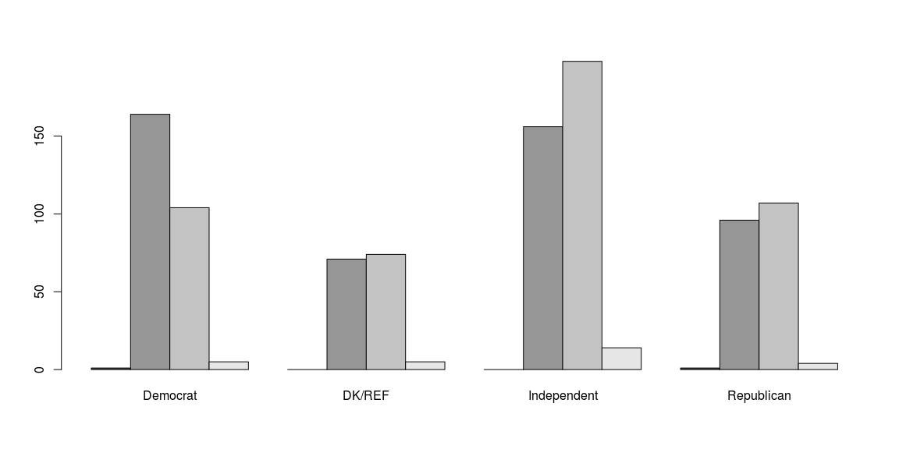
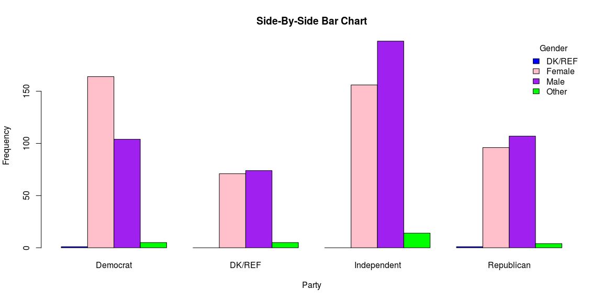
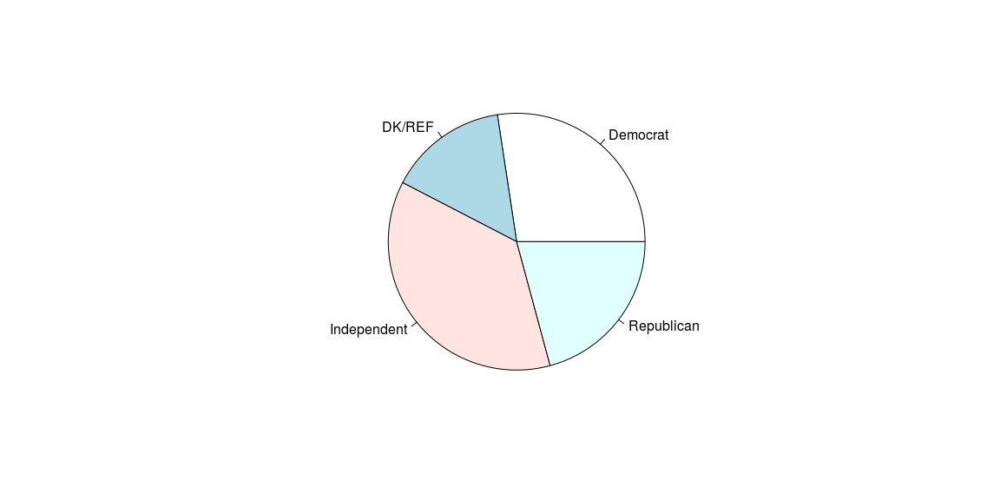

# {.tabset .tabset-fade}


## Categorical Data


```r
pon <- read.csv("201709-CAH_PulseOfTheNation.csv")

# Pivot Table

pon_pivot <- table(pon$Gender,pon$Political.Affiliation)

# Simple side by side

barplot(pon_pivot, beside = T)
```

<!-- -->

```r
# Prettier

barplot(pon_pivot, ylab="Frequency", xlab="Party", main="Side-By-Side Bar Chart", col=c("blue", "pink", "purple" , "green" ), beside=T, width=.3)

legend("topright", title="Gender", legend= sort(unique(pon$Gender)), fill =c("blue", "pink", "purple" , "green" ), box.lty=0)
```

<!-- -->

```r
# Pie

pon_pie <- table(pon$Political.Affiliation)

pie(pon_pie)
```

<!-- -->

## Dotplot


```r
ggplot(pon, aes(x = Age)) + geom_dotplot(binwidth = .5)
```

<!-- -->

```r
ggplot(pon, aes(x = Age, fill = factor(Political.Affiliation))) + geom_dotplot(binwidth = .8)
```

<!-- -->


