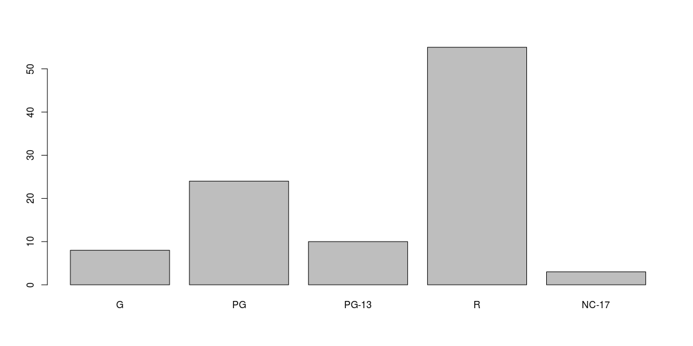
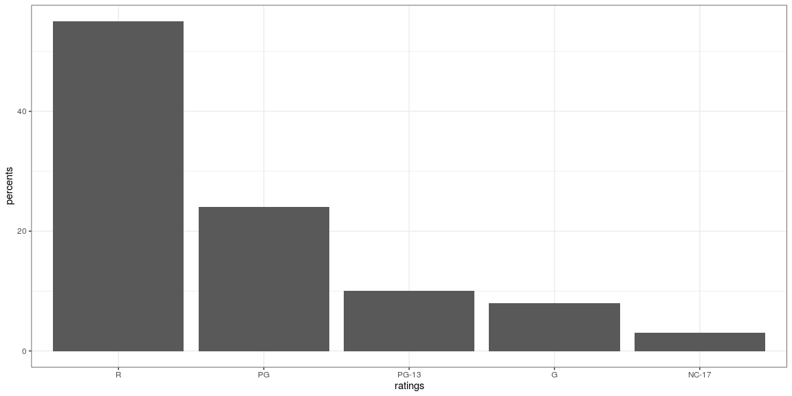
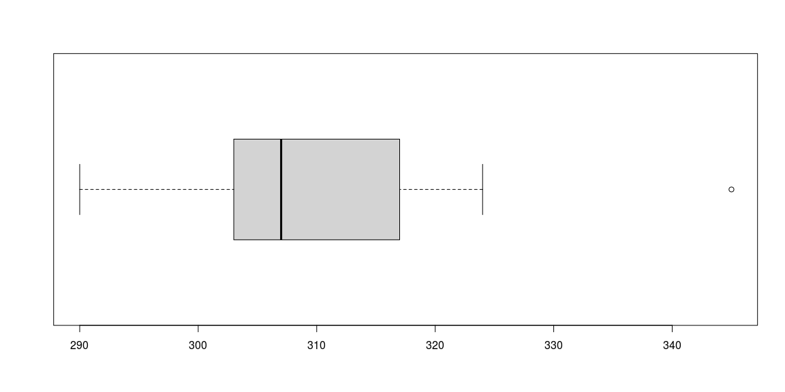
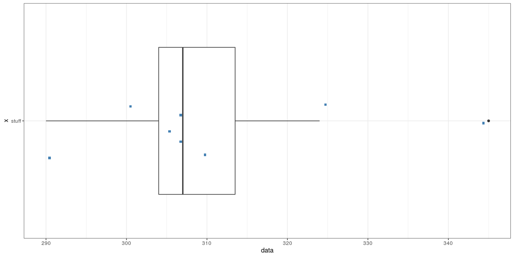

# {.tabset .tabset-fade}


## Categorical Data


```r
pon <- read.csv("201709-CAH_PulseOfTheNation.csv")

# Pivot Table

pon_pivot <- table(pon$Gender,pon$Political.Affiliation)

# Simple side by side

barplot(pon_pivot, beside = T)
```

<!-- -->

```r
# Prettier

barplot(pon_pivot, ylab="Frequency", xlab="Party", main="Side-By-Side Bar Chart", col=c("blue", "pink", "purple" , "green" ), beside=T, width=.3)

legend("topright", title="Gender", legend= sort(unique(pon$Gender)), fill =c("blue", "pink", "purple" , "green" ), box.lty=0)
```

<!-- -->

```r
# Pie

pon_pie <- table(pon$Political.Affiliation)

pie(pon_pie)
```

<!-- -->

## Quantitative Graphs

### Dotplot


```r
ggplot(pon, aes(x = Age)) + geom_dotplot(binwidth = .5)
```

<!-- -->

```r
ggplot(pon, aes(x = Age, fill = factor(Political.Affiliation))) + geom_dotplot(binwidth = .8)
```

<!-- -->

### Histogram


```r
hist(pon$Age)
```

<!-- -->

```r
ggplot(pon, aes(x = Age)) + geom_histogram(binwidth = 5, color = "blue")
```

<!-- -->

### Stem and Leaf


```r
stem(pon$Income)
```

```
## 
##   The decimal point is 4 digit(s) to the right of the |
## 
##    0 | 555555577888899999000000012223334456677788899
##    2 | 0111122222333334455555666778900000011222222445556677788899999999
##    4 | 011112222333344445556667777778888811122223444445555666667777788889
##    6 | 00011122223444455577888889900001111222233333334444444555666777788999
##    8 | 00000011233445556667778899000000011222222333345677788
##   10 | 00001111222333344455556667790223334444678
##   12 | 0012244456677899901122223555677889
##   14 | 000234678800223335799
##   16 | 01122333445677888900245677999
##   18 | 001238489
##   20 | 02347811
##   22 | 036
##   24 | 0
##   26 | 0
##   28 | 
##   30 | 
##   32 | 67
##   34 | 
##   36 | 0
##   38 | 60
##   40 | 
##   42 | 26
##   44 | 
##   46 | 
##   48 | 
##   50 | 000
```


```r
data <- c(310,307,345,324,305,301,290,307)

stem(data)
```

```
## 
##   The decimal point is 1 digit(s) to the right of the |
## 
##   28 | 0
##   30 | 15770
##   32 | 4
##   34 | 5
```

```r
stem(data, scale = 2)
```

```
## 
##   The decimal point is 1 digit(s) to the right of the |
## 
##   29 | 0
##   30 | 1577
##   31 | 0
##   32 | 4
##   33 | 
##   34 | 5
```

### Boxplot


```r
boxplot(data, horizontal = T)
```

<!-- -->

```r
df.stuff <- data.frame(data)
ggplot(df.stuff,aes("stuff",data)) + geom_boxplot() +
    geom_jitter(shape = 15, color = "steelblue", position = position_jitter(width = 0.21)) + coord_flip()
```

<!-- -->

## Numerical

### Summary


```r
summary(data)
```

```
##    Min. 1st Qu.  Median    Mean 3rd Qu.    Max. 
##   290.0   304.0   307.0   311.1   313.5   345.0
```

### Standard Deviation


```r
sd(data)
```

```
## [1] 16.6256
```


### Standard Deviation by Hand


```r
cowboys <- c(310,307,345,324,305,301,290,307)
sdbh <- data.frame("Weight"= cowboys)
```


