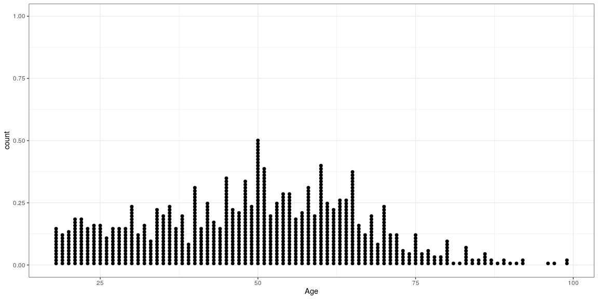
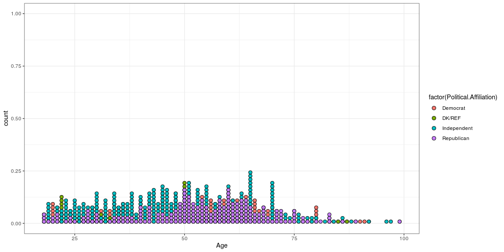

# {.tabset .tabset-fade}


## Categorical Data


```r
pon <- read.csv("201709-CAH_PulseOfTheNation.csv")

# Pivot Table

pon_pivot <- table(pon$Gender,pon$Political.Affiliation)

pon_pivot
```

```
##         
##          Democrat DK/REF Independent Republican
##   DK/REF        1      0           0          1
##   Female      164     71         156         96
##   Male        104     74         198        107
##   Other         5      5          14          4
```

### Bar Chart


```r
# Simple side by side

barplot(pon_pivot, beside = T)
```

<!-- -->

```r
# Prettier

barplot(pon_pivot, ylab="Frequency", xlab="Party", main="Side-By-Side Bar Chart", col=c("blue", "pink", "purple" , "green" ), beside=T, width=.3)

legend("topright", title="Gender", legend= sort(unique(pon$Gender)), fill =c("blue", "pink", "purple" , "green" ), box.lty=0)
```

<!-- -->


```r
ratings <- c("G","PG","PG-13", "R", "NC-17")
percents <- c(8,24,10,55,3)


barplot(percents, names.arg = ratings)
```

<!-- -->

```r
movies <- data.frame(ratings,percents)

movies$ratings <- factor(movies$ratings, levels = movies$ratings[order(movies$percents, decreasing = TRUE)])

ggplot(movies, aes(ratings,percents)) + geom_bar(stat = "identity")
```

<!-- -->

### Pie Chart


```r
pon_pie <- table(pon$Political.Affiliation)

pie(pon_pie)
```

<!-- -->


```r
ratings <- c("G","PG","PG-13", "R", "NC-17")
percents <- c(8,24,10,55,3)

pie(percents, ratings)
```

<!-- -->


## Quantitative Graphs

### Dotplot


```r
ggplot(pon, aes(x = Age)) + geom_dotplot(binwidth = .5)
```

<!-- -->

```r
ggplot(pon, aes(x = Age, fill = factor(Political.Affiliation))) + geom_dotplot(binwidth = .8)
```

<!-- -->

### Histogram


```r
hist(pon$Age)
```

<!-- -->

```r
ggplot(pon, aes(x = Age)) + geom_histogram(binwidth = 5, color = "blue")
```

<!-- -->

### Stem and Leaf


```r
stem(pon$Income)
```

```
## 
##   The decimal point is 4 digit(s) to the right of the |
## 
##    0 | 555555577888899999000000012223334456677788899
##    2 | 0111122222333334455555666778900000011222222445556677788899999999
##    4 | 011112222333344445556667777778888811122223444445555666667777788889
##    6 | 00011122223444455577888889900001111222233333334444444555666777788999
##    8 | 00000011233445556667778899000000011222222333345677788
##   10 | 00001111222333344455556667790223334444678
##   12 | 0012244456677899901122223555677889
##   14 | 000234678800223335799
##   16 | 01122333445677888900245677999
##   18 | 001238489
##   20 | 02347811
##   22 | 036
##   24 | 0
##   26 | 0
##   28 | 
##   30 | 
##   32 | 67
##   34 | 
##   36 | 0
##   38 | 60
##   40 | 
##   42 | 26
##   44 | 
##   46 | 
##   48 | 
##   50 | 000
```


```r
data <- c(310,307,345,324,305,301,290,307)

stem(data)
```

```
## 
##   The decimal point is 1 digit(s) to the right of the |
## 
##   28 | 0
##   30 | 15770
##   32 | 4
##   34 | 5
```

```r
stem(data, scale = 2)
```

```
## 
##   The decimal point is 1 digit(s) to the right of the |
## 
##   29 | 0
##   30 | 1577
##   31 | 0
##   32 | 4
##   33 | 
##   34 | 5
```

### Boxplot


```r
boxplot(data, horizontal = T)
```

<!-- -->

```r
df.stuff <- data.frame(data)
ggplot(df.stuff,aes("stuff",data)) + geom_boxplot() +
    geom_jitter(shape = 15, color = "steelblue", position = position_jitter(width = 0.21)) + coord_flip()
```

<!-- -->

## Numerical

### Summary


```r
summary(data)
```

```
##    Min. 1st Qu.  Median    Mean 3rd Qu.    Max. 
##   290.0   304.0   307.0   311.1   313.5   345.0
```

### Standard Deviation


```r
sd(data)
```

```
## [1] 16.6256
```


### Standard Deviation by Hand


```r
cowboys <- c(310,307,345,324,305,301,290,307)

sdbh <- data.frame("Weight"= cowboys)
cowboy.mean <- mean(cowboys)
sdbh$deviations <- cowboys - cowboy.mean
sdbh$sqdev <- (sdbh$deviations)^2

sumsqdev <- sum(sdbh$sqdev)

Var.cowboys <- sumsqdev / (length(cowboys)-1)

var(cowboys)
```

```
## [1] 276.4107
```

```r
sd.cowboys <- sqrt(Var.cowboys)

sd(cowboys)
```

```
## [1] 16.6256
```

## Normal Curve

### Percentile


```r
# draw the normal curve
curve(dnorm(x,0,1), xlim=c(-4,4), main="Normal density")
 
# define shaded region
from.z <- -4
to.z <- qnorm(.4)
 
S.x  <- c(from.z, seq(from.z, to.z, 0.01), to.z)
S.y  <- c(0, dnorm(seq(from.z, to.z, 0.01)), 0)
polygon(S.x,S.y, col="red")
```

<!-- -->

### Whole Standard Deviations


```r
# First: Calculate stanine breaks (on a z scale)
stan.z <- c(seq(-4, 4))
 
# Second: get cumulative probabilities for these z values
stan.PR <- pnorm(stan.z)
 
# define a color ramp from blue to red (... or anything else ...)
c_ramp <- colorRamp(c("darkblue", "red"), space="Lab")
 
# draw the normal curve, without axes; reduce margins on left, top, and right
par(mar=c(2,0,0,0))
curve(dnorm(x,0,1), xlim=c(-4,4), ylim=c(-0.03, .45), xlab="", ylab="", axes=FALSE)

# Calculate polygons for each stanine region
# S.x = x values of polygon boundary points, S.y = y values
for (i in 1:(length(stan.z)-1)) {
    S.x  <- c(stan.z[i], seq(stan.z[i], stan.z[i+1], 0.01), stan.z[i+1])
    S.y  <- c(0, dnorm(seq(stan.z[i], stan.z[i+1], 0.01)), 0)
    polygon(S.x,S.y, col=rgb(c_ramp(i/9), max=255))
}

# print stanine values in white
# font = 2 prints numbers in boldface
text(seq(-4,4), 0.015, label=-4:4, col="blue", font=2)
 
# print cumulative probabilities in black below the curve
text(seq(-4,4), -0.015, label=paste(round(stan.PR, 5)*100, "%", sep=""), col="black", adj=.5, cex=.8)
text(0, -0.035, label="Percentage of sample <= this value", adj=0.5, cex=.8)
text(seq(-2.5,2.5), .115, label=paste(c(2.35,13.5,34,34,13.5,2.35), "%ish", sep=""), col="black", adj=.5, cex=.8)
```

<!-- -->

